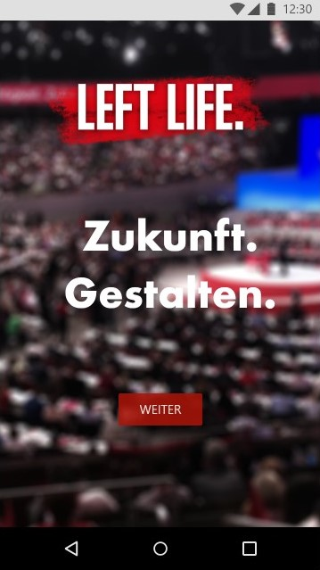
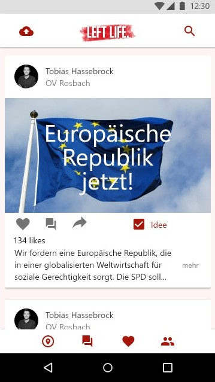

# Left Life

The goal of this project is to build an application which supports political parties and their members to reflect their real-life decisions on a digital platform, make political administration more efficient and scale politics on a global level.

_The final result should be similar to this [prototype](https://xd.adobe.com/view/4934154e-d639-45d7-47ab-212c20ac9258-3f05/)_

# Contact
If you would like to support this project, see [Contributing Guide](docs/tutorials/contributing.md) or write me an email: <a href="mailto:tobias.hassebrock@gmail.com">tobias.hassebrock@gmail.com</a>

# Technology Stack
1. [Angular 7+](https://angular.io)
2. [Angular Material](https://material.angular.io)
3. [AngularFire2](https://github.com/angular/angularfire2)
4. [Firebase & Cloud Functions](https://firebase.google.com/)
5. [NGX Firebase Auth UI](https://ngx-auth-firebaseui.firebaseapp.com)

# Contributing
> “Alone we can do so little; together we can do so much.” - Helen Keller

#### ⚠ Rookie? Don't worry!
For the first contribution in Github, I recommend see the **Fireship.io** lesson 👉 [How to Participate on Github?](https://fireship.io/snippets/git-how-to-participate-on-github/)

* [🚀 Getting started](docs/tutorials/set-up.md)
* [📃 Current Tasks](docs/tutorials/tasks.md)
* [📖 Full Documentation](docs).
